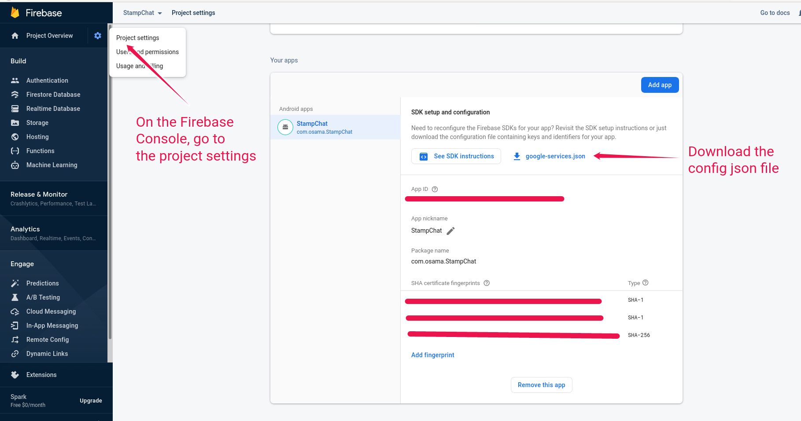

# StampChat Server Infrastructure

StampChat is a mobile chat app. This repo describes the infrastructure behind the app. With this repo, the server can be started either on the local machine using docker compose for development, or can be deployed using Kubernetes to a production environment.

# What For?

This is a side-project. It's also a complete app, backed by servers using a basic microservices pattern, and it's on the Play Store. The main purpose of this project is to go through all the technical steps needed to launch an app.

# Mobile App

A preview of the mobile app and its source code can be found in the [StampChat Mobile App](https://github.com/OsamaElHariri/StampChat_App) repo.

# Backend Services

The app is made up of the following services:

1. [Auth Server](https://github.com/OsamaElHariri/StampChat_AuthServer): Handles authentication requests and generates JWT tokens
2. [Chat Server](https://github.com/OsamaElHariri/StampChat_ChatServer): Handles user messaging, message history, and chat groups. This service includes the Websocket service needed for real-time chatting
3. [Notification Server](https://github.com/OsamaElHariri/StampChat_NotificationsServer): Sends push notifications to users

Each of these services has its own Postgres database that also needs to be up and running for the services to function properly.

# Setting up localhost Testing

In order to run the servers on localhost, docker compose is used to spin up an nginx API gateway on port 8080 and to start up a Postgres database for each of the services. To start the containers, run:
```sh
cd local_host_setup
docker-compose up
```

Once all the containers are running, the individual services need to be started. The steps to run each service is described in that service's repo (the repos are listed above in the Backend Services section).

It is important to run the database migrations for each service when setting up for the first time, otherwise the database will not have any tables.

After the services are set up, and the app is installed on a mobile device, it should be possible to login and create a chat.

**Note:** Connections to port 8080 might be blocked by a firewall. Make sure to allow connections to this port, otherwise the app will not be able to reach the server running on your machine. In my case, I'm using OpenSuse, and I configured this as follows:

1. Open YaST Firewall
2. Zones -> public -> Ports
3. Add 8080 to TCP Ports

# Setting up the Prod Environment

StampChat uses Kubernetes to deploy the various services. Signing up with a cloud provider that offers managed Kubernetes clusters is the first step. The services' databases are necessary, so getting hosted Postgres databases for each service is also a needed.

## Setting the Kubernetes Secrets

In the `./secrets_examples` directory, there are examples of the secrets that need to be available in the cluster. I set these up by first getting the base64 string of each secret, then I replaced the placeholder texts in the config files by these strings. After that, I transferred the file to the machine on the hosted cloud provider, and ran the `kubectl apply -f auth_stamp_chat_secret.yaml`. This was done for all secrets. 

There are three main secrets to take care of. There are the database connection strings, which can be obtained from the database provider. Then there are private keys, the `private_key` secret in the `auth_stamp_chat_secret.yaml` and `secret_key_base` in `channels_stamp_chat_secret.yaml`, which can be generated by an online password generator, for example. I generated them using the command `mix phx.gen.secret`, which is available in Elixir Phoenix projects (the Chat server is built using Phoenix). The last secret to take care of is the Firebase service account config file, which is stored in the `firebase_secrets.yaml` file. To get this file, you'll need to download it from the Firebase console, encode it as a base64 string, and add the string in the config file. This image shows the Firebase console:

<p align="center">
  
</p>

## Setting up a Domain name with TLS in the Cluster

The cluster uses [Ambassador](https://www.getambassador.io/docs/latest/tutorials/getting-started/) as an API gateway. It also leverages some functionality Ambassador provides in order to add TLS and secure the connections. 

For a domain name, I grabbed `stampchat.tk` for free from a site called [freenom](https://www.freenom.com/en/index.html?lang=en). After that, I got the cluster's public IP that Ambassador exposes and added an A record on freenom that points `stampchat.tk` to that IP. The IP can be obtained using the following command (including the `$` symbol):
```sh
$(kubectl -n ambassador get svc ambassador \
-o "go-template={{range .status.loadBalancer.ingress}}{{or .ip .hostname}}{{end}}")
```

To setup Ambassador in the cluster, I followed the [quick start](https://www.getambassador.io/docs/latest/tutorials/getting-started/) guide. To setup TLS termination, I went through these guides: [TLS Termination and Enabling HTTPS](https://www.getambassador.io/docs/latest/howtos/tls-termination/), and [Cert-Manager and Ambassador Edge Stack](https://www.getambassador.io/docs/latest/howtos/cert-manager/).

After going through the steps in the docs and installing all the dependancies, the resulting files are in the `endpoint_setup/` directory. The files in this directory are used to create the Ambassador Host and to set up TLS after the dependancies described in the [Cert-Manager](https://www.getambassador.io/docs/latest/howtos/cert-manager/) guide are installed.


## Deploying the services

Once the secrets are in the cluster and Ambassador is up and running, the services can be deployed by applying the config files for each service. In this project, the order of applying the configs matters since some services assume that other services' IPs will be available in their environment variables. Kubernetes adds these IPs only if the service is already deployed in the cluster, so the order is important to ensure that a service is deployed after its dependancies. To improve this and remove the deploy order dependancy, check this guide on various ways to [access other services](https://kubernetes.io/docs/concepts/services-networking/connect-applications-service/#accessing-the-service).

Starting the notification server (`stamp_chat_notifications.yaml`):
```sh
kubectl apply -f https://raw.githubusercontent.com/OsamaElHariri/StampChat_Kubernetes/main/stamp_chat_notifications.yaml
```

Starting the chat server (`stamp_chat_channels.yaml`):
```sh
kubectl apply -f https://raw.githubusercontent.com/OsamaElHariri/StampChat_Kubernetes/main/stamp_chat_channels.yaml
```

Starting the chat server (`stamp_chat_auth.yaml`):
```sh
kubectl apply -f https://raw.githubusercontent.com/OsamaElHariri/StampChat_Kubernetes/main/stamp_chat_auth.yaml
```

Unlike in the localhost setup, database migrations are taken care of and do not need to be applied manually. Migrations are run in the `initContainers` step in the config files of each service.

At this point, all services should be up and running and ready to receive requests over `https`.